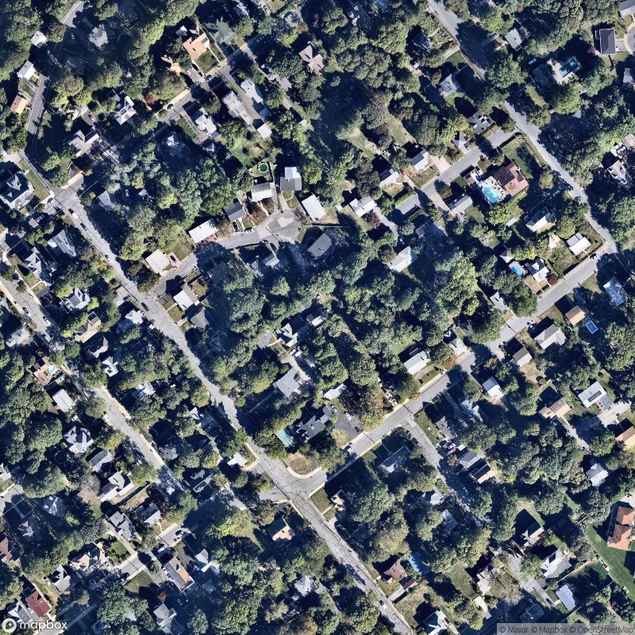
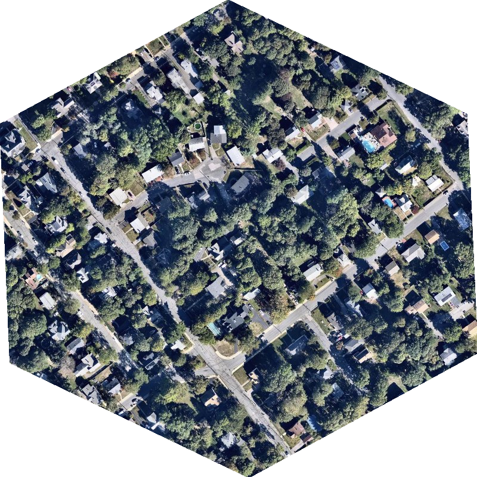

# Simple Script to Generate Cropped Images of a H3 Tile

## Description

Turns:

Into:

## Usage

`pip install -r requirements.txt`

`python generate_image.py --help`

`mkdir output && python generate_image.py --h3 892a3066aafffff --output ./output --tile-res 512 --style satellite-v9`